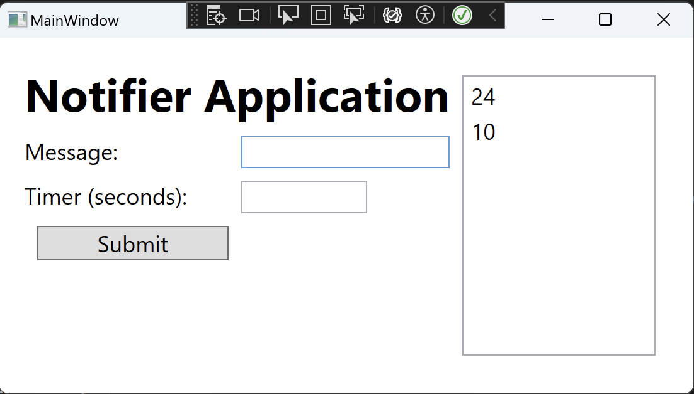

# Notifier Application in WPF

The Notifier application is a WPF application designed to notify users after a specified amount of time. Users can enter a message and specify a timer in seconds. Once the time elapses, a notification will pop up displaying the user's message.

## Features:
- **Set Notifications**: Users can set notifications by entering a message and specifying a timer.
- **View Notifications List**: Users can view a list of upcoming notifications with the time remaining for each.
- **Persistence**: The application saves all the notifications to a file, ensuring data integrity across sessions.

## Requirements:
- **.NET Core 3.1 or later**
- **Newtonsoft.Json**: Used for serializing and deserializing messages to a data file.

## How to Use:
1. Open the application.
2. Enter your desired message in the "Message" textbox.
3. Specify the timer in seconds (0 to 500) in the "Timer (seconds)" textbox.
4. Click on the "Submit" button to add the notification to the list.
5. The application will pop up a message box once the timer for each notification elapses.

## Files Overview:
- **MainWindow.xaml**: The main UI for the application, where users can input messages and set timers.
- **MainWindow.xaml.cs**: Contains the logic for managing the UI interactions and saving/loading the messages.
- **MessageClass.cs**: Defines the `Message` class which represents a single message with a timer.
- **ListOfMessages.cs**: Defines a collection of `Message` objects and provides operations to add and remove messages.

## Classes:
- **MainWindow**: Main UI window for the application. Manages user interactions and saving/loading the notifications.
- **Message**: Represents a single message with timer functionality. Uses a timer to countdown for message notification.
- **ListOfMessages**: Collection of `Message` objects. Allows addition of new messages and removal when a message's timer expires.

## Contribution:
Please ensure that you have the .NET Core SDK installed. To contribute:
1. Fork and clone the repository.
2. Open the solution in Visual Studio or your preferred .NET IDE.
3. Implement your changes or fixes.
4. Submit a pull request with a detailed description of your changes.

## License:
This application is released under the MIT License. Refer to the LICENSE file for more details.
